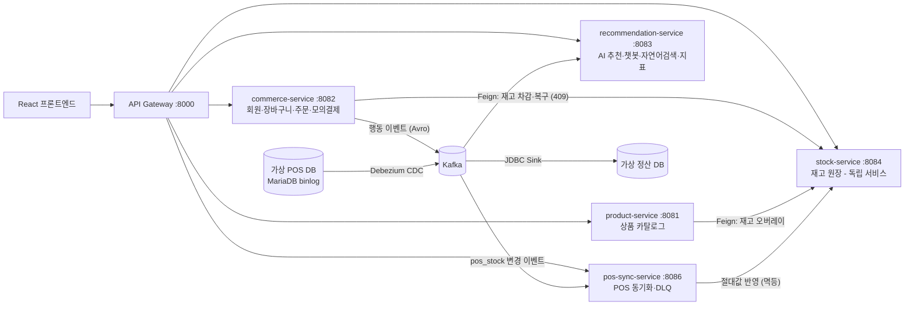

# ZeroPick Omni — 저당·제로 커머스 + 실시간 재고 동기화

> LG CNS AM Inspire Camp 5기 미니프로젝트 2 [팀 프로젝트](https://github.com/2kmkmkm/Retail-AI-Shop)(RTL-M, 난이도 중)의 개인 확장판.
> 팀 결과물 위에 리테일 난이도 '상' 과제(RTL-H)의 핵심 차별화 기술을 얹어
> **RTL-M(중)·RTL-H(상) 두 채점표의 핵심 요구사항을 모두 충족**하도록 재설계했다.

## 아키텍처



재고 소유권은 **stock-service 로 완전히 분리**했다. 온라인 재고(주문 차감·복구)와
POS 재고(CDC 동기화)를 한 원장에서 관리하고, 조건부 UPDATE + 낙관적 락(@Version)으로
동시 주문·동시 동기화의 갱신 유실을 막는다. POS 반영은 after 절대값 세팅이라 멱등이며,
재시도·DLQ 재소비에 안전하다.

## 듀얼 체크리스트 커버리지

### RTL-M (중 · AI 커머스) 핵심 10

| # | 요구사항 | 구현 |
|---|---|---|
| 1 | 서비스 3개 이상 분리 | 도메인 서비스 5개 (product·commerce·reco·stock·pos-sync) |
| 2 | Eureka | 전 서비스 등록 |
| 3 | Gateway 단일 진입점 | 5개 라우트, StripPrefix 없는 프리픽스 규약 |
| 4 | Config 중앙화 | config-service 서빙, LLM 키는 `${LLM_API_KEY}` 환경변수 분리 |
| 5 | OpenFeign 동기 | reco→product(상품), commerce→stock(차감·복구), product→stock(오버레이) |
| 6 | Kafka 비동기 | commerce 행동 이벤트 3종(Avro) 발행 → reco 컨슈머 반영 |
| 7 | 상품/주문 API + 재고 차감 | 상품 검색·비교 + 주문 생성→모의결제→취소, 결제 시 재고 차감(409) |
| 8 | 서비스별 DB 분리·ERD | 서비스별 독립 스키마 (H2·MariaDB) |
| 9 | Docker Compose 통합 기동 | 인프라+서비스 5종+Kafka+SR+Connect+DB 3종 |
| 10 | **[핵심] AI 추천/상담** | 행동 가중치 추천 + LLM(gpt-4o-mini) 챗봇 + 규칙 파서 폴백, 정확도·응답시간 실측 문서화 |

### RTL-H (상 · 실시간 재고 동기화) 핵심 10

| # | 요구사항 | 구현 |
|---|---|---|
| 1 | 온라인주문·재고·POS연계 등 4개 이상 | commerce(주문)·**stock(재고 독립)**·pos-sync(POS연계)·product·reco |
| 2~4 | Eureka·Gateway·Config | 상동 |
| 5 | OpenFeign: 주문→재고 실시간 확인 | commerce → stock-service 차감·복구 (부족 시 409 + 보상 복구) |
| 6 | **[핵심] CDC 소스 커넥터** | Kafka Connect + Debezium(MariaDB) — 가상 POS binlog → `zeropick.pos.pos.pos_stock` |
| 7 | 동기화 + 동시성 제어 | pos-sync 컨슈머 → 재고 원장 반영, 조건부 UPDATE + 낙관적 락(@Version) |
| 8 | 재고/주문 ERD | stock 원장(온라인/POS 분리 컬럼) + 주문 스키마 |
| 9 | Connect 포함 컨테이너화 | docker-compose 에 cdc-connect·pos-db·settlement-db 포함 |
| 10 | **동기화 신뢰성** | 3회 재시도 → DLQ(`zeropick.pos.dlq`) → 재처리 리스너(멱등), JDBC Sink 로 가상 정산 DB 연동, 종단 일관성 검증 스크립트 |

### 선택 요구사항 구현 현황

| 항목 | RTL-M | RTL-H | 구현 |
|---|:-:|:-:|---|
| Schema Registry | ✓ | ✓ | 행동 이벤트 Avro 3종 등록·발행 |
| Circuit Breaker | ✓ | ✓ | Resilience4j — LLM 장애 시 규칙 파서 폴백 (실측 100% 전환) |
| 추천 성과 대시보드 | ✓ | — | 클릭률·폴백률 실시간 집계 + 관리자 화면 |
| 자연어 상품 검색 | ✓ | — | LLM 조건 추출 + 하드필터 파이프라인 |
| 관리자 동기화 현황 화면 | — | ✓ | CDC 반영·DLQ·재처리 카운트 + 최근 이벤트 (관리자 '재고 동기화' 탭) |
| AI 재고 예측 | — | ✓ | 주문 이벤트 기반 일 판매 속도 → 소진 임박 TOP 5 |
| 부하 테스트 | ✓ | ✓ | k6 스크립트 + 실측 요약 (loadtest/) |
| 모니터링 | ✓ | ✓ | Micrometer + Prometheus/Grafana 구성 (monitoring/) |
| Spring Cloud Bus | ✓ | ✓ | bus-kafka + busrefresh (commerce) |
| Kubernetes | ✓ | ✓ | 매니페스트 4종 (k8s/) |
| 로그 중앙화 | ✓ | ✓ | EFK 구성 (efk/, docker-compose.efk.yml) |

## 실행

```bash
# 1) 서비스 빌드 (각 모듈)
for s in config-service service-discovery apigateway-service product-service \
         commerce-service recommendation-service stock-service pos-sync-service; do
  (cd $s && ./mvnw -q -DskipTests package)
done

# 2) 전체 스택 기동 (LLM 키는 선택 — 없으면 챗봇이 규칙 기반 폴백으로 동작)
LLM_API_KEY=<키> docker compose up -d --build

# 3) CDC 커넥터 등록 (Connect REST :8283)
curl -X POST -H "Content-Type: application/json" -d @cdc/connectors/pos-source.json     http://localhost:8283/connectors
curl -X POST -H "Content-Type: application/json" -d @cdc/connectors/settlement-sink.json http://localhost:8283/connectors

# 4) 동기화 확인 — POS 재고를 바꾸면 수 초 내 재고 원장·정산 DB 에 반영된다
docker exec pos-db mariadb -uroot -ppos1234 pos \
  -e "UPDATE pos_stock SET stock = 7 WHERE product_id = 3;"
curl http://localhost:8000/stock-service/stocks/3
curl http://localhost:8000/pos-sync-service/status
```

프론트엔드: `cd frontend && npm i && npm run dev` → http://localhost:5173
(관리자 콘솔 `/admin` — 재고 동기화 현황 탭에서 CDC 파이프라인을 실시간 확인)

## 원본과의 차이

- 팀 결과물: [2kmkmkm/Retail-AI-Shop](https://github.com/2kmkmkm/Retail-AI-Shop) — RTL-M 요구사항 대상, 4인 팀 개발. 원본 README 는 docs/README_원본팀.md
- 이 저장소: 위 결과물에 재고 서비스 분리 + POS CDC 동기화(RTL-H 핵심기술)를 추가한 개인 확장판
- 회원 인증은 데모 간소화 버전(팀 저장소의 JWT 발급 구현과 다름)
